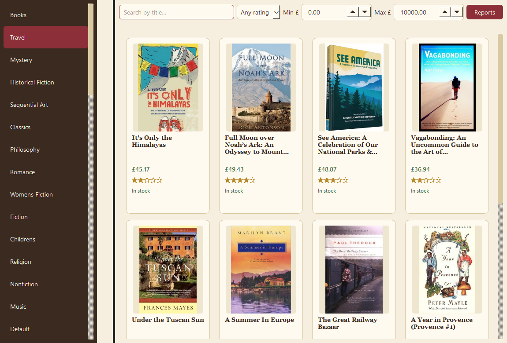
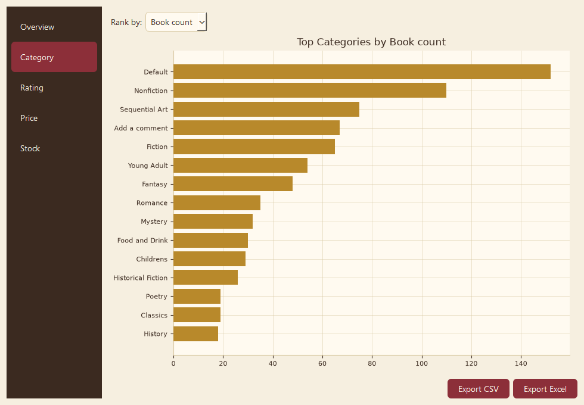
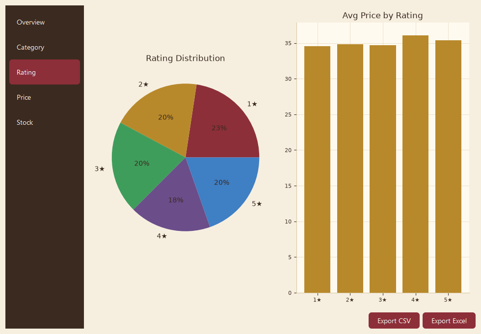

# Books Explorer

**A desktop application for scraping, analyzing, and reporting on ~1,000 books from [books.toscrape.com](https://books.toscrape.com/) — built with Python, PySide6, pandas, and matplotlib.**

This project demonstrates an end-to-end data pipeline: concurrent web scraping -> data modeling -> a native GUI -> statistical analysis -> chart-based reporting -> file export. It was built as a portfolio piece to showcase both **data engineering/analysis** and **desktop application development** skills.



## Why this project

Most scraper demos stop at "print the data to the console." This one takes it further: the scraped data feeds a real desktop application with search/filtering, a themed UI, background threading so the interface never freezes, and an analytics layer that turns raw scrape results into pie charts, bar charts, histograms, and exportable spreadsheets - the kind of pipeline that mirrors real internal tooling.

## Features

- **Web scraping**: category discovery, pagination handling, and per-book detail extraction (title, price, rating, stock, description, cover image) using `requests` + `BeautifulSoup`.
- **Accurate category resolution**: each book's *real* category is parsed from its detail page's breadcrumb trail, not just the listing it was reached through — so browsing the site's all-books catalogue still yields correctly categorized results.
- **Concurrent fetching for performance**: a `QThreadPool` + `ThreadPoolExecutor` combo fetches book detail pages in parallel over a shared, connection-pooled `requests.Session`. Result: the full ~1,000-book catalogue scrapes in **~27 seconds** instead of several minutes sequentially.
- **Responsive native GUI (PySide6/Qt)**: category sidebar, live search, rating/price filters, a card-based book grid with async thumbnail loading, and a detail dialog — all backed by background workers so the UI thread never blocks.
- **Smart caching**: fetching the site's top-level "Books" catalogue automatically back-fills the cache for every individual category (derived from real per-book categories), so subsequent navigation is instant with zero redundant network calls.
- **In-app analytics & reporting**: a `pandas`-powered analysis module aggregates the dataset by category, rating, price, and stock status, rendered as matplotlib pie charts, bar charts, and histograms embedded directly in the Qt UI.
- **Data export**: one-click export to CSV (raw dataset) or a multi-sheet Excel workbook (raw data + category/rating/stock summaries) via `openpyxl`.
- **Custom design system**: a cohesive "library" visual theme (parchment/espresso/burgundy palette) applied consistently across the app and its charts via a shared QSS stylesheet and a validated chart color palette.

## Tech stack

| Layer | Technology |
|---|---|
| Scraping | `requests`, `BeautifulSoup4`, `lxml` |
| Concurrency | `QThreadPool`, `concurrent.futures.ThreadPoolExecutor` |
| Desktop UI | `PySide6` (Qt for Python) |
| Data analysis | `pandas` |
| Visualization | `matplotlib` (Qt-embedded canvases) |
| Export | `openpyxl` (multi-sheet `.xlsx`), `csv` |

## Architecture

The codebase is layered so each concern is independently testable and swappable:

```
books-scraper/
├── main.py                 # Application entry point
├── scraper.py               # Pure scraping functions — no Qt dependency
├── analysis.py               # Pure pandas aggregation/export functions — no Qt dependency
├── Book.py / Category.py      # Validated data models
├── requirements.txt
└── gui/
    ├── main_window.py         # Main window: sidebar, filters, book grid, wiring
    ├── workers.py              # QRunnable background workers (network I/O off the UI thread)
    ├── book_card.py             # Book grid tile widget
    ├── book_detail_dialog.py    # Book detail popup
    ├── report_dialog.py          # Analytics & reporting window (charts + export)
    ├── chart_utils.py             # Matplotlib-in-Qt embedding + theme-consistent styling
    └── styles.py                  # Central QSS stylesheet / color palette
```

**Design principles applied:**
- **Separation of concerns**: `scraper.py` and `analysis.py` have zero Qt imports — they're plain, unit-testable Python and could be reused in a CLI or notebook.
- **Non-blocking UI**: all network I/O runs on `QRunnable` workers in a `QThreadPool`; results return to the UI thread via Qt signals.
- **Single-flight fetching with cache fan-out**: a request for one category is deduplicated against in-flight fetches, and results are automatically distributed to every category they touch.

## Performance

Fetching detail pages sequentially for the full catalogue would take several minutes. By reusing a single `requests.Session` (connection pooling) and fanning out detail-page requests across a 16-worker thread pool, the same ~1,000-book fetch completes in **~27 seconds** — roughly a 10-15x improvement, verified by direct benchmarking.

## Reports




The reporting window (opened from the main toolbar) always operates on the full scraped dataset and includes:

- **Overview** — headline stats (total books, categories, average price/rating, stock rate)
- **Category** — top categories ranked by book count, average price, or average rating (horizontal bar chart)
- **Rating** — distribution across 1–5 stars (pie chart) plus average price per rating
- **Price** — descriptive statistics (min/max/mean/median) and a price histogram
- **Stock** — in-stock vs. out-of-stock breakdown (pie chart)

Every report can be exported as CSV (flat dataset) or a multi-sheet Excel workbook (raw data + all summary tables) in a single click.

## Getting started

```bash
git clone <this-repo>
cd books-scraper
pip install -r requirements.txt
python main.py
```

No API keys or configuration required — the app scrapes the public [books.toscrape.com](https://books.toscrape.com/) sandbox site, built specifically for scraping practice.

## Possible extensions

- Persist scraped data to a local database (SQLite) for offline/historical analysis
- Scheduled re-scraping with price-change tracking over time
- Packaging as a standalone executable (PyInstaller)
